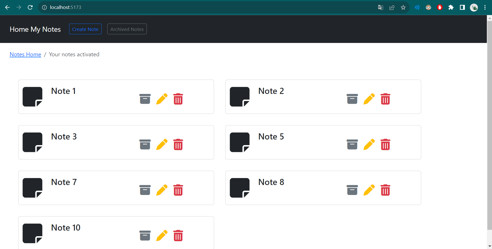
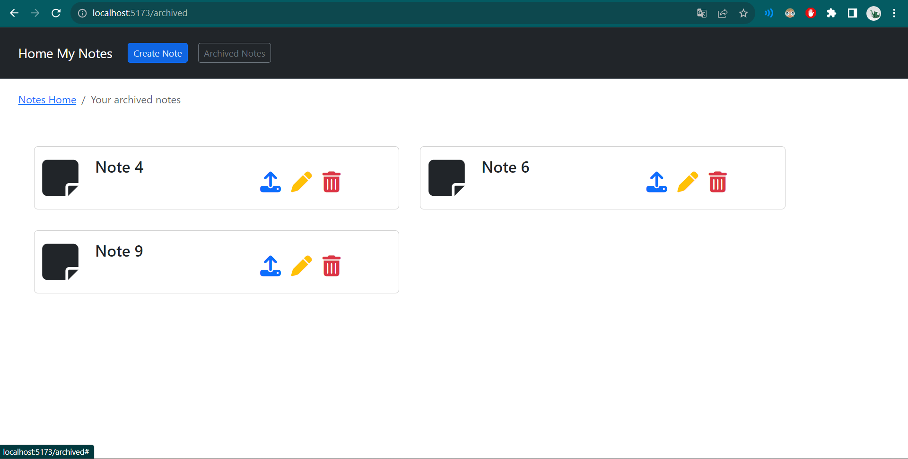
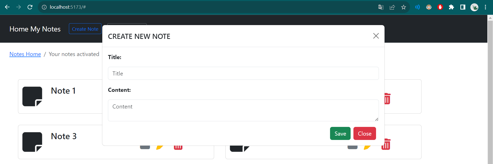
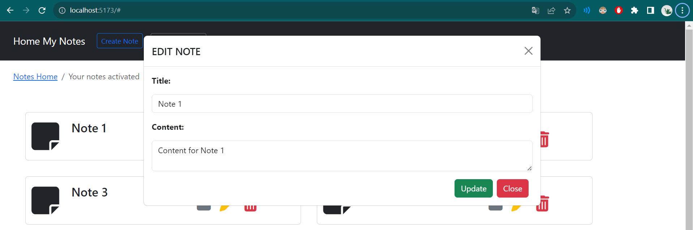
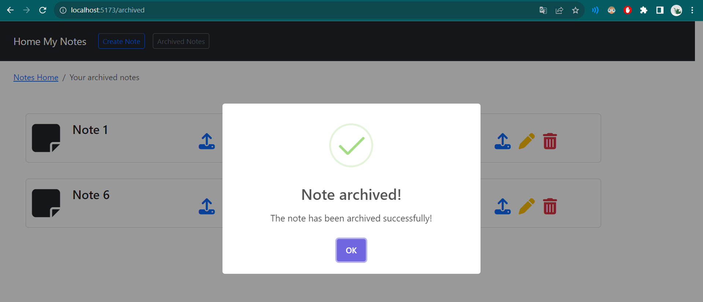
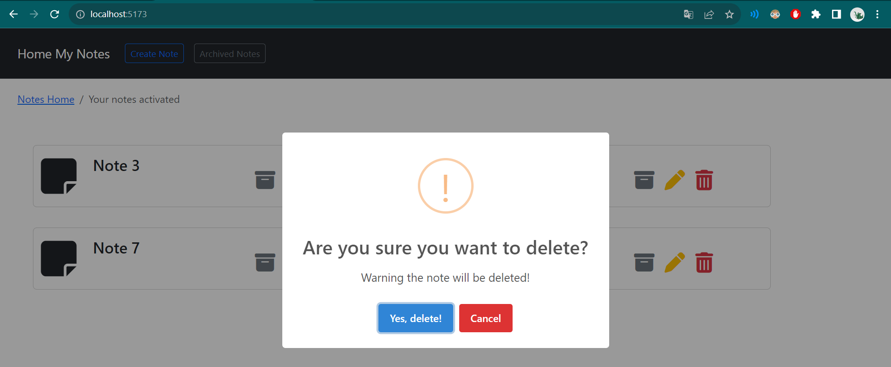

<h2>Test Ensolvers - Keny Danfer Chumacero Jibaja</h2>
<div align="center">
<h3 align="center">NOTES APP</h3>
  <p align="center">
      
  </p>
</div>

### Backend Built With

- 
- 
- 
- 

### Frontend Built With

- 
- 
- 
- 

<!-- GETTING STARTED -->

## Getting Started

To get a local copy up and running follow these steps.

### Prerequisites

- JDK 17 [https://jdk.java.net/java-se-ri/17](https://jdk.java.net/java-se-ri/17)
- Gradle [https://gradle.org/install/](https://gradle.org/install/)
- MySQL [https://dev.mysql.com/downloads/installer/](https://dev.mysql.com/downloads/installer/)
- Node 18.16.1 [https://nodejs.org/es/download](https://nodejs.org/es/download)

### Recommended Tools

- Visual Studio Code [https://code.visualstudio.com/download](https://code.visualstudio.com/download)
- IntelliJ Community [https://www.jetbrains.com/idea/download/](https://www.jetbrains.com/idea/download/)
- Postman [https://www.postman.com/downloads/](https://www.postman.com/downloads/)

### Installation and manual execution

1. Clone the repository

   ```sh
   git clone url-repo notes-app
   ```

2. Change directory
   ```sh
   cd notes-app
   ```
3. Update the database connection settings in backend
   ```yml
   # src/main/resources/application.properties
   spring.datasource.url=jdbc:mysql://localhost:3306/db_notes
   spring.datasource.username=root
   spring.datasource.password=<your-password>
   ```

4. open and run backend
   ```sh
   ~ cd backend
   ~ gradle build
   ~ gradle bootRun
   ```

4. open and run frontend
   ```sh
   ~ cd frontend
   ~ npm install
   ~ npm run dev
   ```

### Install and run with Docker

You need to have Docker installed.

 - 
- Docker Desktop [https://docs.docker.com/get-docker/](https://docs.docker.com/get-docker/)


1. Clone the repository

   ```sh
   ~ git clone url-repo notes-app
   ```

2. Change directory
   ```sh
   ~ cd notes-app
   ```

3. Execute
   ```sh
   ~ docker-compose up
   ```

<!-- USAGE -->

## Usage

1. Open [http://localhost:5173](http://localhost:5173) in your web browser

## Views:
Notes Actived


Notes Archived


Create Note


Edit Note


Note Archived!


Note Removed!


